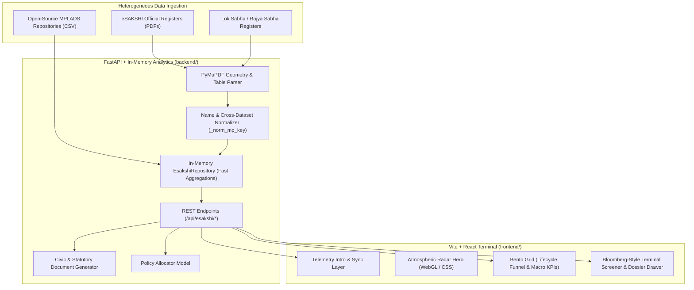

# Signal Horizon: Comprehensive Project Analysis Report

**Document Version:** 1.0  
**Project Classification:** Public Finance Telemetry & Algorithmic Accountability Radar  
**Target Domain:** Indian Parliamentary MPLADS (Members of Parliament Local Area Development Scheme) Funds  

---

## 1. Executive Summary

**Signal Horizon** is a specialized, real-time public finance telemetry and civic accountability platform built to monitor, audit, and analyze the distribution and utilization of India's **MPLADS** (Members of Parliament Local Area Development Scheme) funds across both houses of Parliament (**Lok Sabha** and **Rajya Sabha**).

The system addresses the systemic lack of transparency in public infrastructure expenditures by aggregating disparate, semi-structured government datasets (PDF audit ledgers, official eSAKSHI portals, and granular open-source CSV data). It computes empirical utilization velocity, flags high-risk fiscal discrepancies, simulates policy-driven budget allocations via an "AI District Commissioner" model, and generates statutory civic action drafts (RTI applications, First Appeals, and PIL briefs).

### Core Highlights
- **Total Tracked Outlay:** ₹11,676.79 Crores
- **Tracked Parliamentarians:** 774 MPs (Lok Sabha & Rajya Sabha)
- **Monitored Public Works:** 163,675+ projects across Indian districts, blocks, and villages
- **Statutory Document Engine:** Automatic assembly of Section 6(1) RTI applications, Section 19(1) First Appeals, and Article 21 PIL briefs.

---

## 2. System Architecture & Component Breakdown

Signal Horizon is designed with a high-throughput, decoupled client-server architecture:

---

## 3. Data Pipeline & Datasets Analysis

### 3.1 Datasets Utilized

| Dataset | Location | Size | Ingestion Strategy | Key Attributes Extracted |
| :--- | :--- | :--- | :--- | :--- |
| **Official eSAKSHI Registers** | `eSAKSHI/` | ~158 MB | Geometry-based PDF coordinate extraction (`PyMuPDF`) | MP names, state, constituency, sanctioned limit (₹ Cr), calamity donations, sample expenditure vouchers |
| **Granular Works Database** | `india-mplads-works-main/csv/MPLADS.csv` | ~40 MB | Delimited streaming parser | Work ID, sector, estimated cost, sanction dates, IDA implementing agency, village, block |

### 3.2 Key Data Normalization Innovations
- **Cross-House Entity Resolution (`_norm_mp_key`)**: Normalizes Indian parliamentary name conventions by stripping honorary prefixes (`Shri`, `Smt`, `Dr`, `Prof`, `Adv`, `Sardar`, etc.), parenthesized terms, dots, and trailing tenure brackets (e.g. `(2019-24)`). This reliably correlates MP allocations to open-source work items.
- **Dynamic Risk Categorization**: Allocations are evaluated on empirical utilization rates and work execution velocities to classify MPs into **Review Required**, **Medium Risk**, and **Low Risk** bands.

---

## 4. Feature Matrix & Functional Capabilities

### A. Lifecycle Transformation Funnel & Macro KPIs
- Tracks the pipeline transformation: **Recommended $\rightarrow$ Sanctioned $\rightarrow$ Completed**.
- Exposes national drop-off rates, highlighting bureaucratic latency between recommendation and sanction.
- Aggregates calamity relief consents across major national disaster events.

### B. Bloomberg-Style Terminal Screener
- Searchable directory of all 774 MPs with instantaneous multi-filter slicing:
  - By **House** (Lok Sabha, Rajya Sabha, All India)
  - By **State / Union Territory**
  - By **Risk Band** (`Review Required`, `Medium`, `Low`, `ALL`)
- Integrated client-side pagination (15 rows/page) optimized for smooth rendering across extensive datasets.

### C. MP Dossier & Deep Audit Drawer
Selecting any parliamentarian reveals a comprehensive breakdown:
1. **Fiscal Dossier**: Outlay, utilization percentage, recommended/sanctioned/completed ratios.
2. **Project Works Register**: Granular itemization of local civil works, including implementing agency (IDA), sanction dates, and sector.
3. **Civic Legal Assistant**:
   - **RTI Draft (Section 6(1))**: Programmatically addresses the relevant District Magistrate / CPIO with pre-filled ledger and voucher demand clauses.
   - **First Appeal (Section 19(1))**: Pre-filled grounds of appeal citing Section 4(1)(b) proactive disclosure mandates.
   - **PIL Brief (Article 21)**: Formatted preliminary counsel note linking public infrastructure neglect to constitutional fundamental rights.
4. **AI District Commissioner**:
   - Generates an optimal needs-based normative budget profile (Drinking Water, Primary Healthcare, Connectivity, Education, Civic Resilience) contrasting actual spending against recommended civil priorities.

---

## 5. Technology Stack Review

| Layer | Technologies | Evaluation |
| :--- | :--- | :--- |
| **Frontend** | React 18, TypeScript, Vite, Tailwind CSS, Lucide React | Extremely fast dev server and production builds (~2.5s). Zero heavyweight UI libraries; bespoke cybernetic dark theme ("Liquid Obsidian") with ambient gradient lighting. |
| **Backend** | FastAPI, Python 3.10+, PyMuPDF (fitz), Pydantic v2 | High-performance asynchronous REST endpoints. In-memory caching (`@lru_cache`) provides sub-50ms API response times without external database overhead during analysis. |
| **Data Processing** | PyMuPDF, Pandas, Regular Expressions | Highly resilient custom table geometry extractors that handle complex, multi-column government PDF variations. |
| **Database Models** | SQLAlchemy 2.0 ORM (defined in `models.py`) | Ready for persistence into PostgreSQL or SQLite if migration from in-memory cache to a permanent relational store is desired. |

---

## 6. Current Strengths & Identified Opportunities

### Strengths
1. **High Self-Containment**: No external database server (PostgreSQL/Redis) is required to run the application; the backend loads, structures, and indexes PDF/CSV records directly in-memory.
2. **Rapid Cold-Start**: Zero complicated build pipelines; simple `npm run build` and `uvicorn main:app` execution.
3. **Action-Oriented Civic Tech**: Bridges the gap between static data visualization and real-world legal action by synthesizing ready-to-file statutory documents.

### Recommended Next Steps & Roadmap
1. **Persistent Cache / SQLite Index**: While the in-memory loader takes ~7 seconds to parse datasets on first cold start, pre-indexing records into an embedded SQLite/DuckDB database would reduce cold start time to under 100ms.
2. **Dynamic AI Integration**: Connect the legal document and budget generator directly to LLM endpoints (e.g. Gemini 1.5 Flash via `@google/genai`) for real-time natural language synthesis of local constituency audits.
3. **Export Capabilities**: Add direct PDF/DOCX download buttons for the generated RTI and PIL documents within the Terminal Screener.
